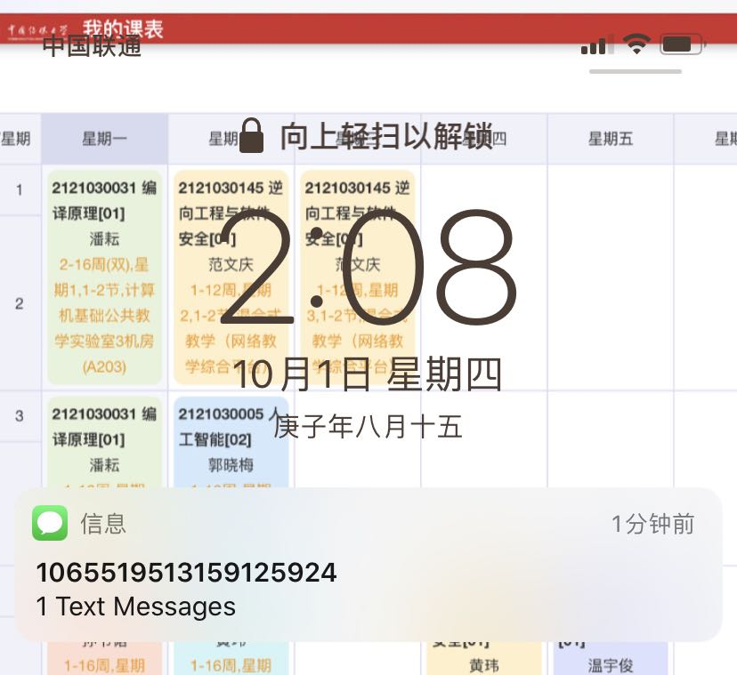
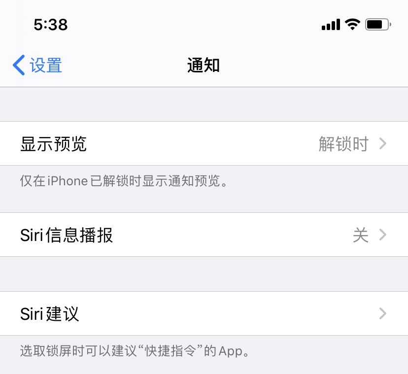

# 网络安全第二章实验报告  
## 操作系统的访问控制设计实例研究  
### 注意事项  
1. 请准确记录、描述实验运行环境信息，包括但不限于：操作系统版本（如果是第三方应用，请给出精确版本号）、硬件设备型号、是否默认设置。  
2. 请综合运用访问控制模型、威胁建模、安全假设和信任等专业知识和语言论证安全问题。  

### 实验环境  
* 操作系统：IOS 13.6  
* 手机型号：iPhone 11  
* 是否默认设置：是  

### 实验过程  
当系统处于锁屏状态下接收到新短信时，不解锁情况下  
* 系统是否允许查看短信内容？  
不允许查看短信内容  

* 系统是否允许回复短信？  
不允许回复，提示解锁可用

当系统处于锁屏状态下，使用系统内置（例如 iOS 的 Siri ）或第三方的语音助手可以完成以下哪些操作？  
- [ ] 访问通讯录  
- [x] 拨打电话  
- [ ] 访问相册  
- [ ] 查看短信收件箱  

如果你的手机支持指纹识别解锁手机，请实验并分析指纹识别相比较于简单密码、复杂密码、图形解锁、人脸识别解锁、声纹解锁等解锁方式的安全性、便利性差异。  
* 我的手机仅支持人脸识别解锁和密码解锁，但我本身更倾向于指纹识别解锁，相对来说判断准确率会更高，例如人脸识别解锁，最经常的问题是，识别出错，即使区别仅在于有无戴眼镜、有无戴口罩，准确率较低，很不方便，与此相比，指纹解锁会更准确，而且不易出错。  

### 思考题  
以上设计实现方式属于我们课堂上讲过的哪种强制访问控制模型？Lattice/BLP？Biba？  
*  属于Lattice/BLP模型，上写下读  

系统或第三方应用程序是否提供了上述功能的访问控制规则修改？如果修改默认配置，是提高了安全性还是降低了安全性？  
* 系统提供了访问控制规则修改  
  
* 一般要根据情况具体讨论，如果修改合理，会方便使用，如果修改不合理，将会大大降低安全性  

#### 参考资料  
[网络安全教材第二章](https://c4pr1c3.github.io/cuc-ns/chap0x02/main.html)  
[网络安全第二章课件](https://c4pr1c3.github.io/cuc-ns-ppt/chap0x02.md.html#/4/17)  
[iOS的权限管理机制](https://www.zhihu.com/question/21728660)

