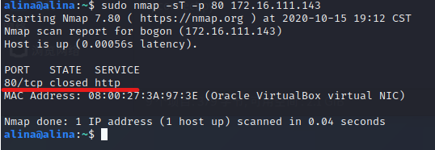

# 网络安全第五章实验报告  

## 基于 Scapy 编写端口扫描器  

### 实验目的  

* 掌握网络扫描之端口状态探测的基本原理  

### 实验环境  
* python + scapy 2.4.3  
* nmap  

### 网络拓扑结构  
  
|身份|虚拟机名称|网卡|IP地址|
|--|--|--|--|
|网关|DEBIAN-1|intnet1|172.16.111.1|
|攻击者主机|KALI-attack|intnet1|172.16.111.134|
|目标靶机|KKK|intnet1|172.16.111.143|  

### 实验要求  
- [x] 完成以下扫描技术的编程实现  
  * TCP connect scan / TCP stealth scan  
  * TCP Xmas scan / TCP fin scan / TCP null scan  
  * UDP scan  
- [x] 上述每种扫描技术的实现测试均需要测试端口状态为：`开放`、`关闭`和`过滤`状态时的程序执行结果  
- [x] 提供每一次扫描测试的抓包结果并分析与课本中的扫描方法原理是否相符？如果不同，试分析原因  
- [x] 在实验报告中详细说明实验网络环境拓扑、被测试 IP 的端口状态是如何模拟的  
- [x] （可选）复刻`nmap`的上述扫描技术实现的命令行参数开关

### 实验过程  
* 实验原理  
  

* 端口状态模拟  
  1. 关闭状态  
  `sudo ufw disable`  
  `systemctl stop apache2`  
  `systemctl stop dnsmasq` 关闭端口  
  2. 开放状态  
  `systemctl start apache2` 开启服务开放TCP端口  
  `systemctl start dnsmasq` 开启服务开放UDP端口  
  3. 被过滤状态  
  `sudo ufw enable && sudo ufw deny 80/tcp`  
  `sudo ufw enable && sudo ufw deny 53/udp`  


* TCP connect scan  
  ```
  #攻击者主机编写TCPconnect.py
  from scapy.all import *
  def tcpconnect(dst_ip,dst_port,timeout=10):
      pkts=sr1(IP(dst=dst_ip)/TCP(dport=dst_port,flags="S"),timeout=timeout)
      if (pkts is None):
          print("FILTER")
      elif(pkts.haslayer(TCP)):
          if(pkts[1].flags=='AS'):
              print("OPEN")
          elif(pkts[1].flags=='AR'):
                  print("CLOSE")
  tcpconnect('172.16.111.143',80)
  ```  
    * Closed  
    靶机检测自身端口状态  
      
    攻击者主机运行`TCP connect scan` python脚本  
      
    靶机Wireshark抓包  
      
    分析：TCP三次握手机制，攻击者主机向靶机发送连接请求后，靶机相应端口处于关闭状态，靶机将会向攻击者返回[RST,ACK]包，抓包结果与预期结果一致。  

    * Open  
    靶机开放80端口  
    `systemctl start apache2` 开启apache2服务从而开放80端口  
    攻击者主机运行`TCP connect scan` python脚本  
      
    靶机Wireshark抓包  
      
    分析：TCP三次握手机制，攻击者主机向靶机发送连接请求后，收到靶机返回[SYN/ACK]数据包，抓包结果与预期结果一致。  

    * Filtered  
    靶机添加规则过滤80端口  
    `sudo ufw enable && sudo ufw deny 80/tcp`  
      
    攻击者主机运行`TCP connect scan` python脚本  
      
    靶机Wireshark抓包  
      
    分析：TCP三次握手机制，攻击者主机向靶机发送连接请求后，没有得到任何响应，抓包结果与预期结果一致。  
* 攻击者主机`nmap`复刻  
  * Closed  
  `sudo nmap -sT -p 80 172.16.111.143`  
    
  * Open  
  `sudo nmap -sT -p 80 172.16.111.143`  
    
  * Filtered  
  `sudo nmap -sT -p 80 172.16.111.143`  
    

* TCP stealth scan  
原理与TCP connect scan类似
  ```
  #攻击者主机编写tcpstealth.py
  from scapy.all import *
  def tcpstealthscan(dst_ip , dst_port , timeout = 10):
      pkts = sr1(IP(dst=dst_ip)/TCP(dport=dst_port,flags="S"),timeout=10)
      if (pkts is None):
          print ("Filtered")
      elif(pkts.haslayer(TCP)):
          if(pkts.getlayer(TCP).flags == 0x12):
              send_rst = sr(IP(dst=dst_ip)/TCP(dport=dst_port,flags="R"),timeout=10)
              print ("Open")
          elif (pkts.getlayer(TCP).flags == 0x14):
              print ("Closed")
          elif(pkts.haslayer(ICMP)):
              if(int(pkts.getlayer(ICMP).type)==3 and int(stealth_scan_resp.getlayer(ICMP).code) in [1,2,3,9,10,13]):
                  print ("Filtered")
  tcpstealthscan('172.16.111.143',80)
  ```  
  * Open  
    
    
  * Closed  
    
    
  * Filtered  
    
    
* 攻击者主机`nmap`复刻  
  * Open  
  `sudo nmap -sS -p 80 172.16.111.143`  
    
  * Closed  
  `sudo nmap -sS -p 80 172.16.111.143`  
    
  * Filtered  
  `sudo nmap -sS -p 80 172.16.111.143`  
    

* TCP Xmas scan  
  ```  
  #攻击者主机编写tcpxmas.py
  from scapy.all import *
  def Xmasscan(dst_ip , dst_port , timeout = 10):
      pkts = sr1(IP(dst=dst_ip)/TCP(dport=dst_port,flags="FPU"),timeout=10)
      if (pkts is None):
          print ("Open|Filtered")
      elif(pkts.haslayer(TCP)):
          if(pkts.getlayer(TCP).flags == 0x14):
              print ("Closed")
      elif(pkts.haslayer(ICMP)):
          if(int(pkts.getlayer(ICMP).type)==3 and int(pkts.getlayer(ICMP).code) in [1,2,3,9,10,13]):
              print ("Filtered")
  Xmasscan('172.16.111.143',80)
  ```  
  * Closed  
    
    
  分析：Xmas发送TCP请求，在靶机端口关闭状态下，靶机响应[RST，ACK]，抓包结果与预期结果一致。  
  * Open  
    
    
  分析：Xmas发送TCP请求，在靶机端口开放状态下，靶机无响应，抓包结果与预期结果一致。  
  * Filtered  
    
    
  分析：Xmas发送TCP请求，在靶机端口被过滤状态下，靶机无响应，抓包结果与预期结果一致。  
* 攻击者主机`nmap`复刻  
  * Closed  
  `sudo nmap -sX -p 80 172.16.111.143`  
    
  * Open  
  `sudo nmap -sX -p 80 172.16.111.143`  
    
  * Filtered  
  `sudo nmap -sX -p 80 172.16.111.143`  
    

* TCP fin scan  
原理与TCP Xmas scan类似  
  ```
  #攻击者主机编写tcpfin.py
  from scapy.all import *
  def finscan(dst_ip , dst_port , timeout = 10):
      pkts = sr1(IP(dst=dst_ip)/TCP(dport=dst_port,flags="F"),timeout=10)#发送FIN包
      if (pkts is None):
          print ("Open|Filtered")
      elif(pkts.haslayer(TCP)):
          if(pkts.getlayer(TCP).flags == 0x14):
              print ("Closed")
      elif(pkts.haslayer(ICMP)):
          if(int(pkts.getlayer(ICMP).type)==3 and int(pkts.getlayer(ICMP).code) in [1,2,3,9,10,13]):
              print ("Filtered")
  finscan('172.16.111.143',80)
  ```  
  * Closed  
    
    
  * Open  
    
    
  * Filtered  
    
  

* 攻击者主机`nmap`复刻  
  `sudo nmap -sF -p 80 172.16.111.143`  
  * Closed  
    
  * Open  
    
  * Filtered  
    

* TCP null scan  
原理与TCP Xmas scan类似  
  ```
  #攻击者主机编写tcpnull.py
  from scapy.all import *
  def nullscan(dst_ip , dst_port , timeout = 10):
      pkts = sr1(IP(dst=dst_ip)/TCP(dport=dst_port,flags=""),timeout=10)
      if (pkts is None):
          print ("Open|Filtered")
      elif(pkts.haslayer(TCP)):
          if(pkts.getlayer(TCP).flags == 0x14):
              print ("Closed")
      elif(pkts.haslayer(ICMP)):
          if(int(pkts.getlayer(ICMP).type)==3 and int(pkts.getlayer(ICMP).code) in [1,2,3,9,10,13]):
              print ("Filtered")
  nullscan('172.16.111.143',80)
  ```  
  * Filtered  
    
    
  * Closed  
    
    
  * Open  
    
    
  

* 攻击者主机`nmap`复刻  
  `sudo nmap -sN -p 80 172.16.111.143`  
  * Filtered  
    
  * Closed  
    
  * Open  
    

* UDP scan  
  ```
  #攻击者主机编写udp.py
  from scapy.all import *
  def udpscan(dst_ip,dst_port,dst_timeout = 10):
      resp = sr1(IP(dst=dst_ip)/UDP(dport=dst_port),timeout=dst_timeout)
      if (resp is None):
          print("Open|Filtered")
      elif (resp.haslayer(UDP)):
          print("Open")
      elif(resp.haslayer(ICMP)):
          if(int(resp.getlayer(ICMP).type)==3 and int(resp.getlayer(ICMP).code)==3):
              print("Closed")
          elif(int(resp.getlayer(ICMP).type)==3 and int(resp.getlayer(ICMP).code) in [1,2,9,10,13]):
              print("Filtered")
          elif(resp.haslayer(IP) and resp.getlayer(IP).proto==IP_PROTOS.udp):
              print("Open")
  udpscan('172.16.111.143',53)
  ```  
  * Closed  
    
    
  分析：UDP扫描属于开放式扫描，靶机udp/53 端口关闭状态下，对攻击者主机并无任何响应，抓包结果与预期结果一致。  
  * Open  
    
    
  分析：UDP扫描属于开放式扫描，靶机udp/53 端口开启状态下，对攻击者主机并无任何响应，无法判断被过滤或开启，抓包结果与预期结果一致。  
  * Filtered  
    
    
  分析：UDP扫描属于开放式扫描，靶机udp/53 端口被过滤状态下，对攻击者主机并无任何响应，无法判断被过滤或开启，抓包结果与预期结果一致。  
* 攻击者主机`nmap`复刻  
  `sudo nmap -sU -p 53 172.16.111.143`  
  * Closed  
    
  * Open  
    
  * Filtered  
    


### 问题及解决  
1. 攻击者主机中python代码运行失败  
  
错误原因：权限不够  
解决方案：改为`sudo python3 tcpconnect.py` 运行  
2. 靶机`sudo ufw disable`无法关闭 tcp/80 端口  
错误原因：apache2服务继续占用80端口  
解决方案：`systemctl stop apache2` 直接关闭apache2服务  
    
3. 直接打开对应服务开启特定端口  
`systemctl start apache2` 开启tcp/80端口  
`systemctl start dnsmasq` 开启udp/53端口  


#### 参考资料  
[网络安全教材第五章](https://c4pr1c3.github.io/cuc-ns/chap0x05/main.html)  
[网络安全第五章课件](https://c4pr1c3.github.io/cuc-ns-ppt/chap0x05.md.html#/3/1)  
[2019-NS-Public-chencwx](https://github.com/CUCCS/2019-NS-Public-chencwx/blob/ns_chap0x05/ns_chapter5/%E7%BD%91%E7%BB%9C%E6%89%AB%E6%8F%8F%E5%AE%9E%E9%AA%8C%E6%8A%A5%E5%91%8A.md)  


