# 网络安全第七章实验报告  
## Web 应用漏洞攻防 - Juice Shop  

### 实验目的  
* 了解常见 Web 漏洞训练平台  
* 了解常见 Web 漏洞的基本原理  
* 掌握 OWASP Top 10 及常见 Web 高危漏洞的漏洞检测、漏洞利用和漏洞修复方法  

### 实验环境  
* Kali  
* Juice Shop  
* Burp Suite v2020.9.2  
* Chrome  

### 实验要求  
 - [x] 每个实验环境完成不少于5种不同漏洞类型的漏洞利用练习  
 - [x] （可选）使用不同于官方教程中的漏洞利用方法完成目标漏洞利用练习  
 - [ ] （可选）最大化漏洞利用效果实验  
 - [x] （可选）编写自动化漏洞利用脚本完成指定的训练项目  
 - [x] （可选）定位缺陷代码  
 - [ ] （可选）尝试从源代码层面修复漏洞  

### 实验过程  

#### juice-shop  
* 实验环境准备  
`cd ctf-games/owasp/juice-shop/ && sudo docker-compose up -d` 开始搭建环境  
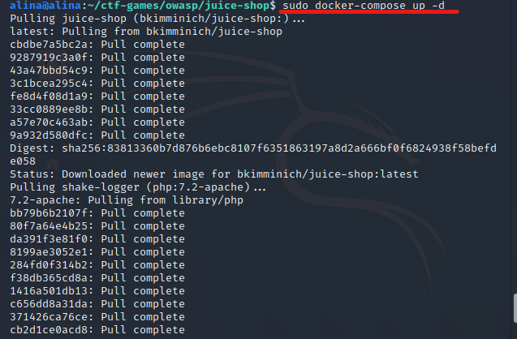  
`sudo vim docker-compose.yml` 更改配置文件开放所有端口  
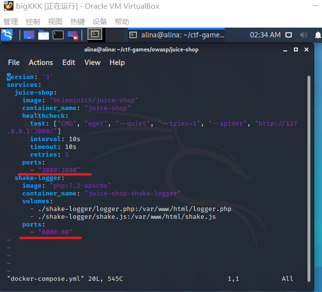  
`docker ps` 查看docker状态  
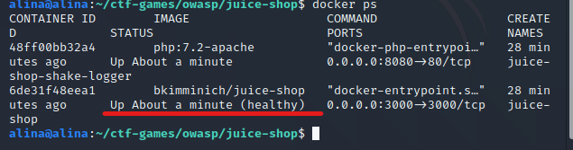  

Host-Only网卡IP地址及开放端口号在主机中成功访问  
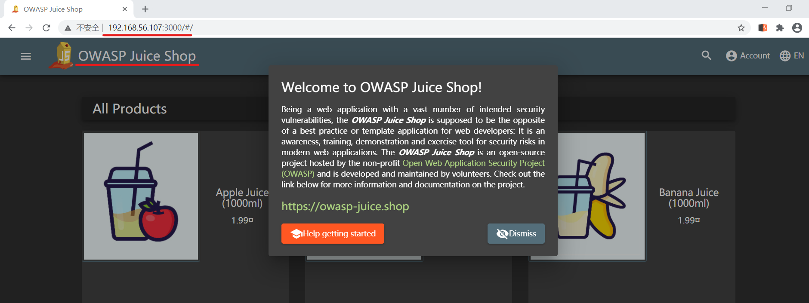  

注册账户并登录  
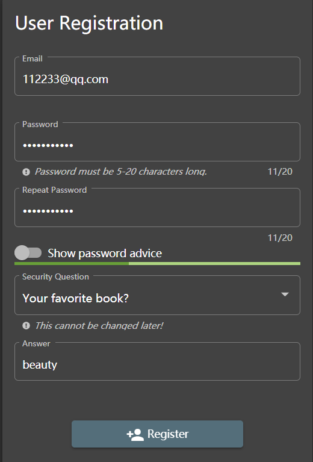  

* Score Board  
在网页中随意点击，发现URL每次仅更改#/后的部分  
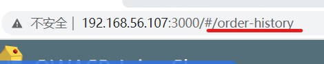  
尝试修改为`score-board`，成功找到计分板  
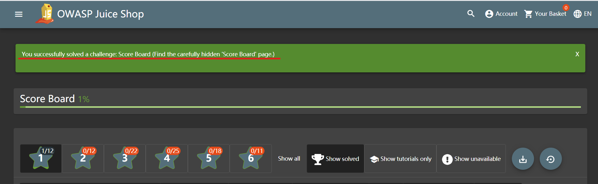  
tips:正式解决方式是不是应该在源代码里查找哇(前端代码实在不熟，真的在代码里翻了好久  
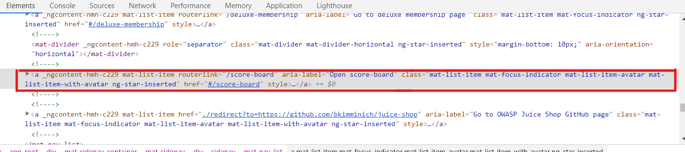  

##### XSS  

* DOM XSS  
根据提示把```<iframe src="javascript:alert(`xss`)">```输入到搜索框  
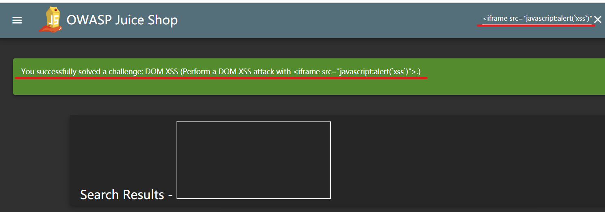  
* Bonus Payload  
同理将```<iframe width="100%" height="166" scrolling="no" frameborder="no" allow="autoplay" src="https://w.soundcloud.com/player/?url=https%3A//api.soundcloud.com/tracks/771984076&color=%23ff5500&auto_play=true&hide_related=false&show_comments=true&show_user=true&show_reposts=false&show_teaser=true"></iframe>```输入到搜索框  
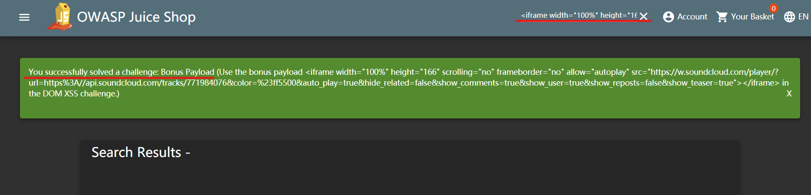  

##### Injection  

* Login Admin  
查看商品评论，发现账户邮箱后缀`@juice-sh.op`，尝试管理员邮箱为`admin@juice-sh.op`进行SQL注入  
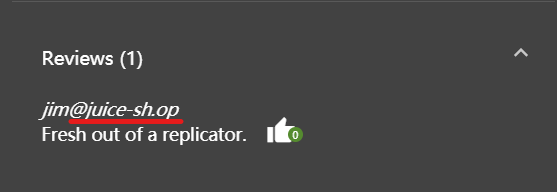  
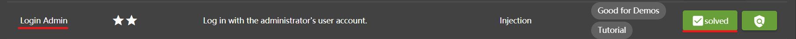  

* Login Bender/Login Jim  
同理，使用`bender/jim@juice-sh.op'--`进行SQL注入  
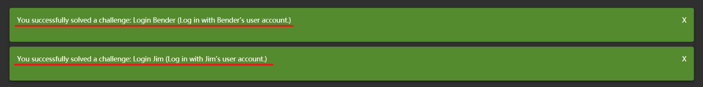  

tips:被猜到邮箱也实在太危险了  

* Christmas Special  
(说实话 这是个意外)在做`Payback Time`时，如果商品编号为1，一直不能send成功，顺手把商品编号改为10，顺利破解`Christmas Special`:joy:  
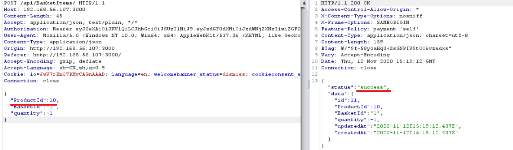  
  


##### Broken Access Control  
* Admin Section  
题目要求进入管理界面，SQL注入登录管理员账户，盲改URL添加`administration`成功进入管理界面(管理员账户总要有点特殊功能吧)  
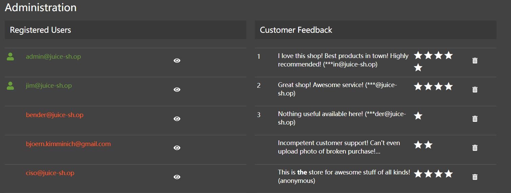  
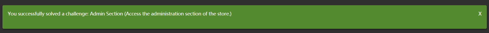  
* Five-Star Feedback  
根据`Admin Section`成果，直接删除所有五星评论即可  
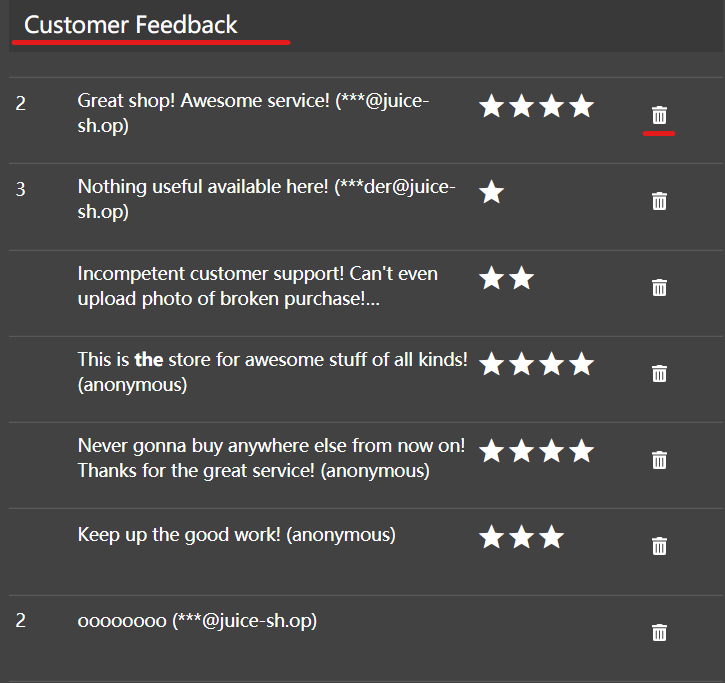  
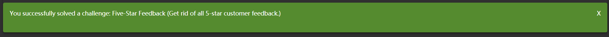  
* View Basket  
题目要求查看其他人的购物车，Burp Suite发现查看购物车请求时后面的`/1`序号，更改后重新发送请求，成功  
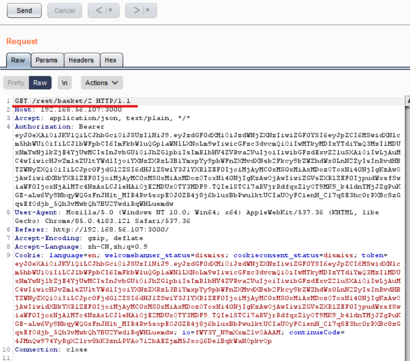  
  

##### Improper Input Validation  
* Zero Stars  
在用户反馈中输入评价，选择一个评级，提交后在Burp Suite中将`rating`修改为0  
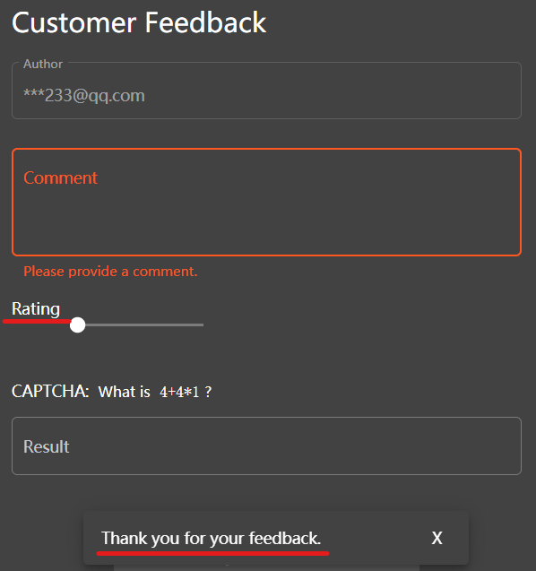  
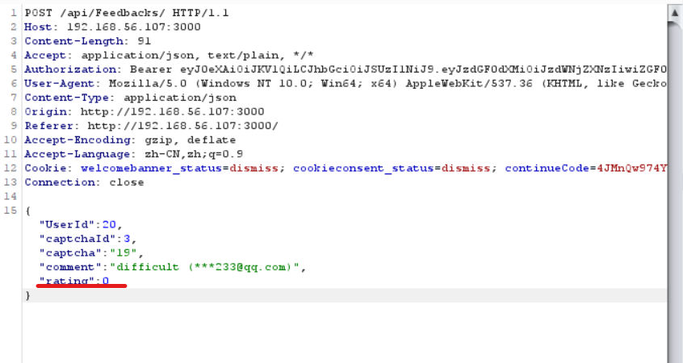  
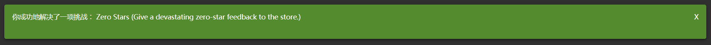  

* Missing Encoding  
在照片墙中发现缺失图片，检查源代码，找到对应URL  
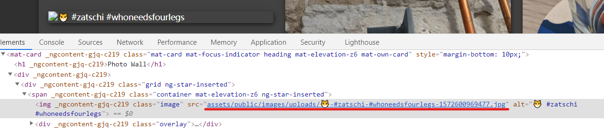  
用在线工具进行URL编码  
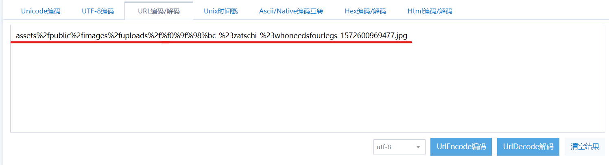  
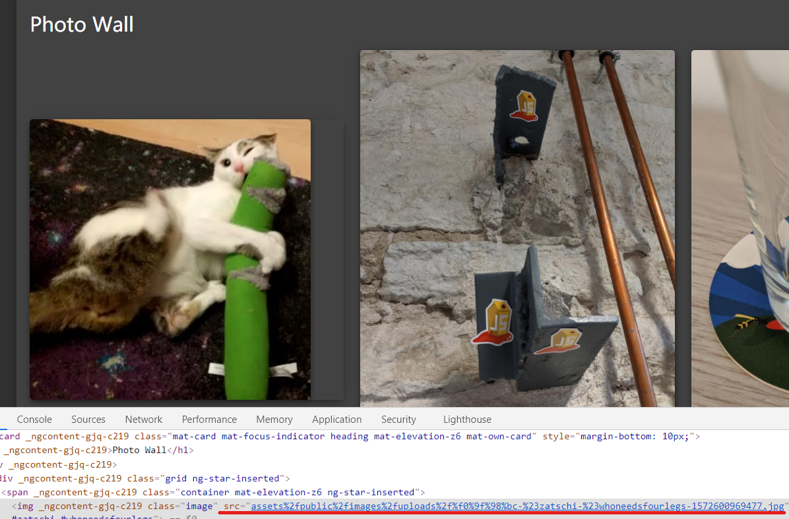  

* Repetitive Registration  
**DRY：Don't repeat yourself**  
在Burp Suite找到注册请求，更改用户名，置空重复密码  
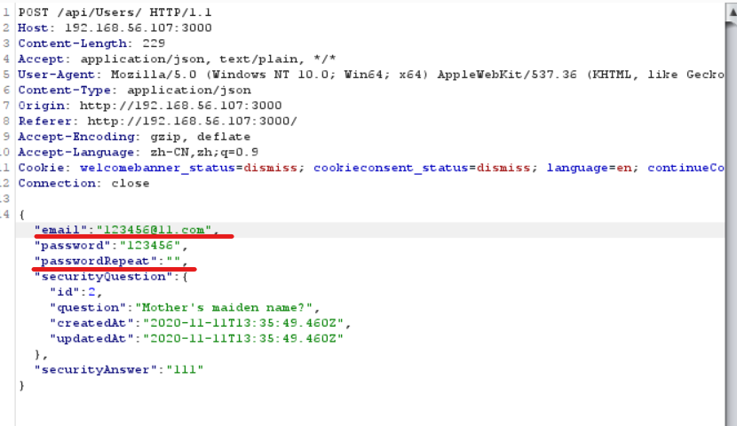  
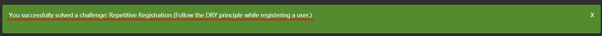  

* Upload Type  
上传一个符合要求的后缀文件，在Burp Suite中修改后缀，成功  
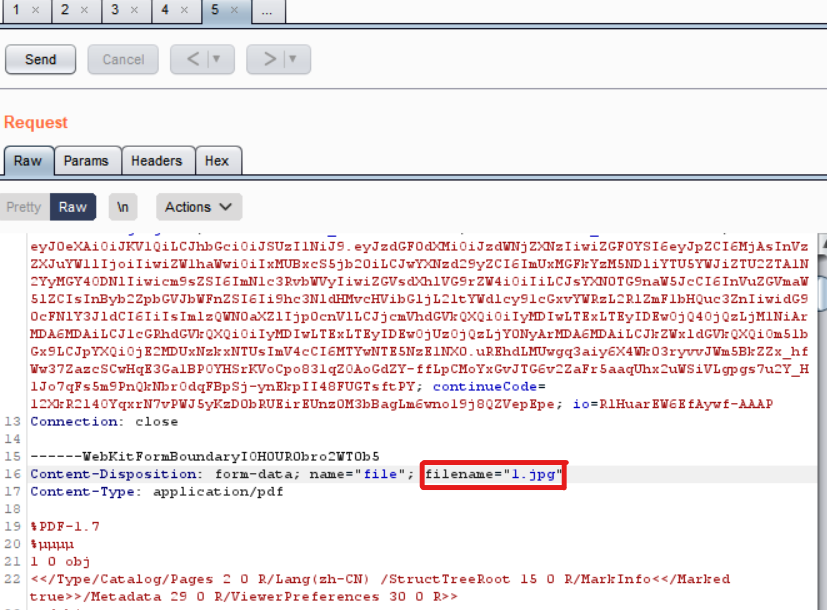  
  

* Payback Time  
将商品加入购物车，在Burp Suite中找到相关请求，将商品数量改为负数，send返回`success`后付款结账  
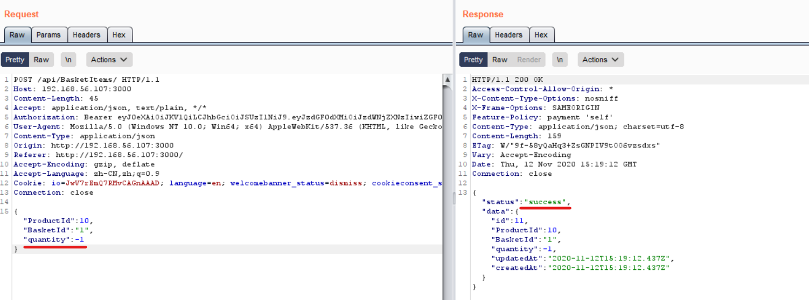  
  


##### Sensitive Data Exposure  
* Confidential Document  
在关于我们板块中进入法律条款链接，观察URL发现`/ftp`路径  
  
进入后打开`acquisitions.md`，成功  
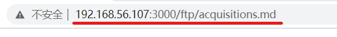  
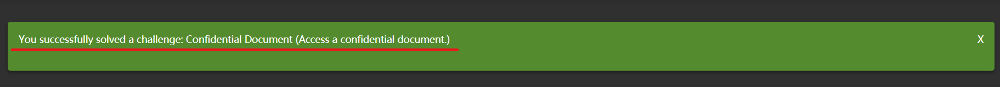  

##### Broken Authentication  
* Bjoern's Favorite Pet  
疯狂在评论下寻找，最终成功找到Bjoern的注册邮箱  
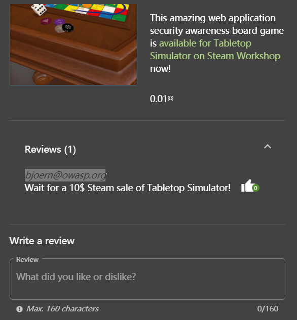  
发现密保问题为`name of favorite pet`  
Google找到了Bjoern的Facebook主页(以为信息在这里)  
[bjoern.kimminich Facebook](https://www.facebook.com/bjoern.kimminich)  
(找了一大圈发现根本没有，甚至还傻呵呵注册)  
最终发现答案在演讲视频里(人傻了 我以为这个是讲解视频)  
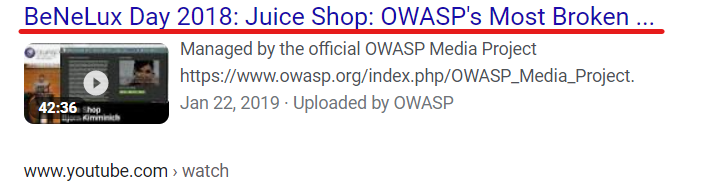  
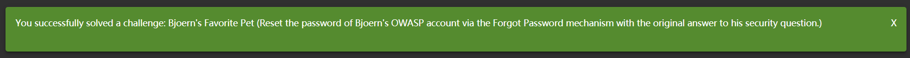  
参考：[2020-ns-public-ididChan](https://github.com/CUCCS/2020-ns-public-ididChan/blob/chap0x07-2/chap0x07-2/%E5%AE%9E%E9%AA%8C%E6%8A%A5%E5%91%8A.md)  
* Password Strength  
先用SQL注入方式登入管理员账号，在Burp Suite中找到token，进行base64解码  
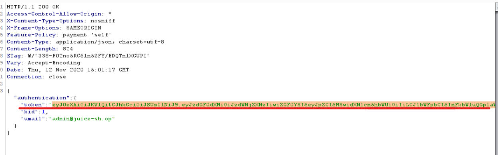  
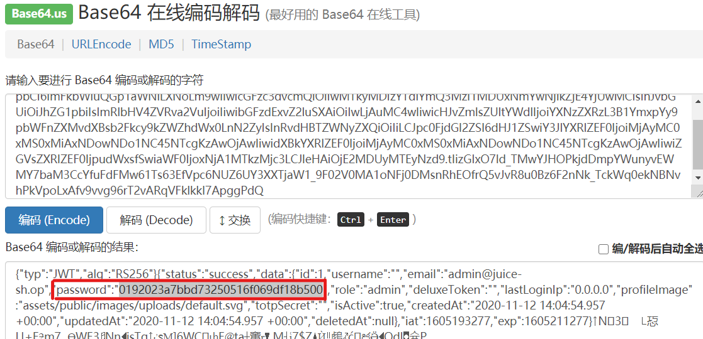  
得到的base64解码结果进行MD5暴力破解  
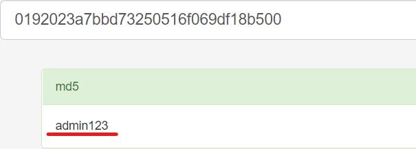  
用户名密码直接登录  
  

* Change Bender's Password  
先用SQL注入方式登入账号，在Burp Suite中找到token，进行base64解码  
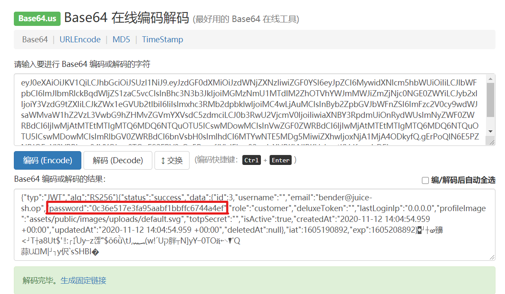  
上一解法无效，然后就开始无能为力:sob:  
(参考：[2020-ns-public-ididChan](https://github.com/CUCCS/2020-ns-public-ididChan/blob/chap0x07-2/chap0x07-2/%E5%AE%9E%E9%AA%8C%E6%8A%A5%E5%91%8A.md) 貌似也是暴力破解MD5得到密码)  


##### Security Misconfiguration  
* Error Handling  
在我解决注册会员的路上偶遇浏览器卡死，当我疯狂点击支付时，突然解决了`Error Handling`(这只是个意外)  
  

##### 问题及解决  
1. 问题：磁盘空间不足  
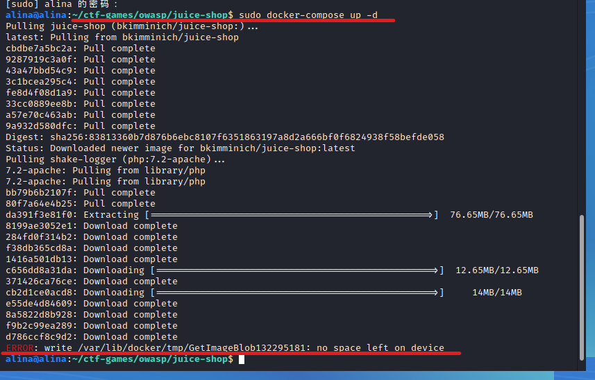  
解决：别问 问就是 (我还有机会吗  
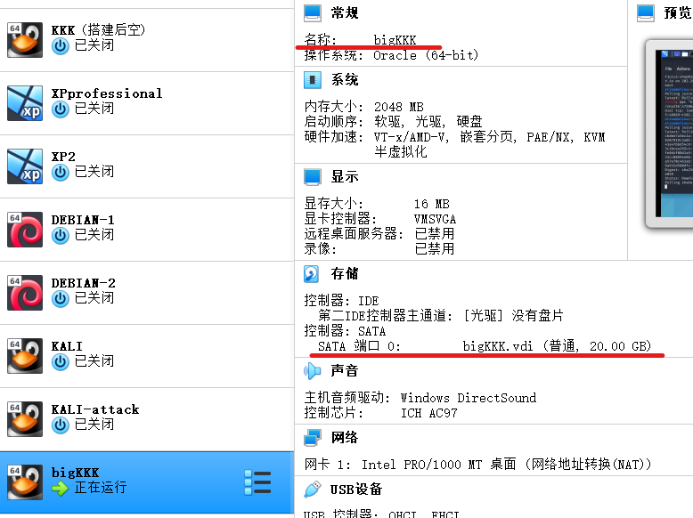  
也尝试黄大给的虚拟机加虚拟硬盘方法，奈何加过之后变成循环登录，依旧无解，最终选择重装  
码(虚拟机实现无损扩容)  
[如何为Virtualbox虚拟硬盘扩容](https://www.cnblogs.com/xueweihan/p/5923937.html)  
2. 问题：环境搭建失败  
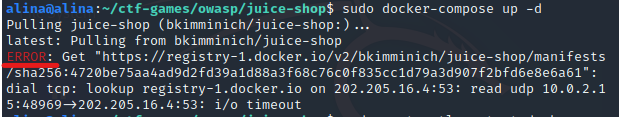  
解决：`sudo systemctl restart docker` 重启一下docker即可(这是手气问题？？)  
参考：[CSDN](https://blog.csdn.net/subiluo/article/details/100894982)  

#### 总结  
1. 至理名言：**一切罪恶都是源于恶意输入数据**  
2. 真正的**实战环境**远比想象中的更困难(个人觉得Juice Shop比WebGoat不友好了不止一点点)  
3. 总是要在痛苦之后才想起给虚拟机做快照  

##### 参考资料  
[网络安全教材第七章](https://c4pr1c3.github.io/cuc-ns/chap0x07/main.html)  
[Pwning OWASP Juice Shop](https://bkimminich.gitbooks.io/pwning-owasp-juice-shop/content/)  
[2019-NS-Public-chencwx](https://github.com/CUCCS/2019-NS-Public-chencwx/blob/ns_chap0x07/ns_chapter7/Web%20%E5%BA%94%E7%94%A8%E6%BC%8F%E6%B4%9E%E6%94%BB%E9%98%B2.md)  
[Intruder模块(暴力破解)](https://blog.csdn.net/u011781521/article/details/54772795)  
[OWASP juice shop笔记（二）](https://blog.csdn.net/x1t02m/article/details/82560575)  
[MD5解码](https://www.somd5.com/)  
[base64编解码](https://base64.us/)  

