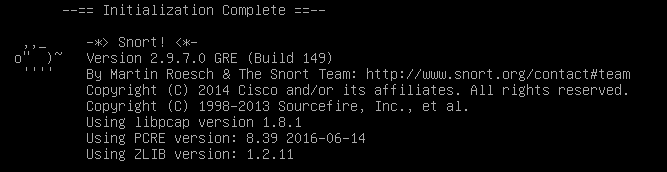
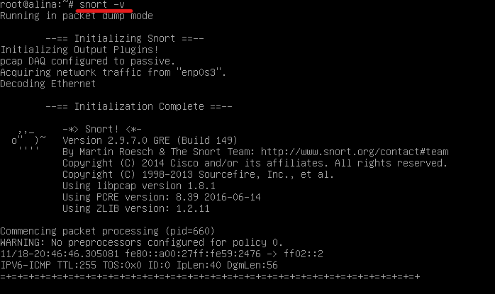
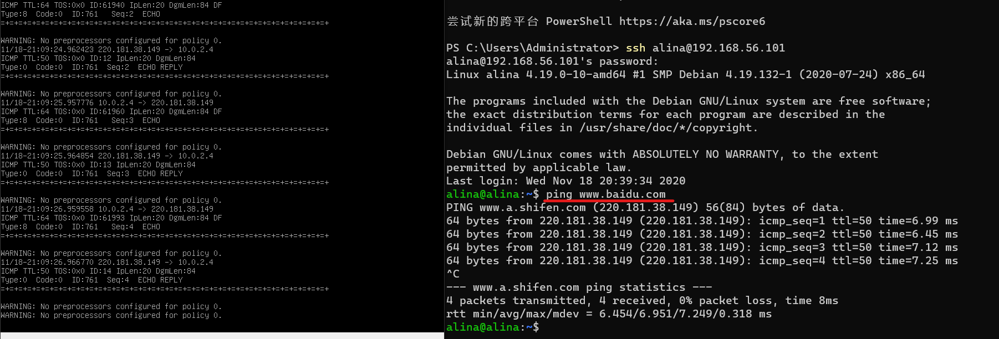
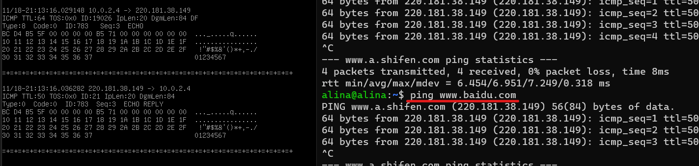
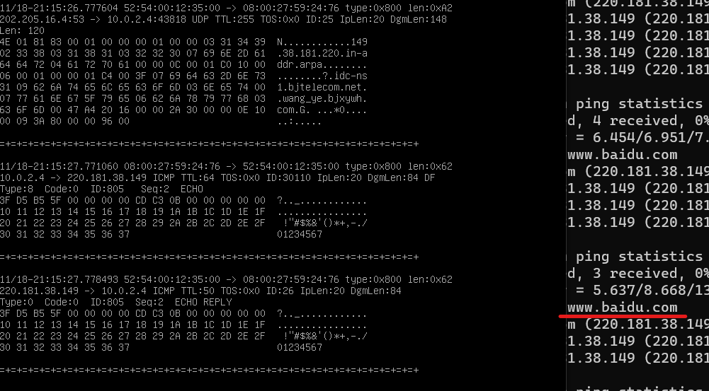
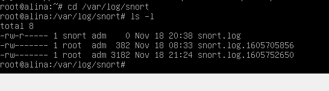
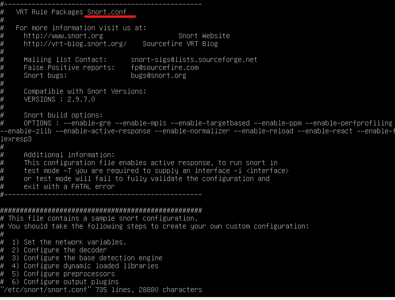
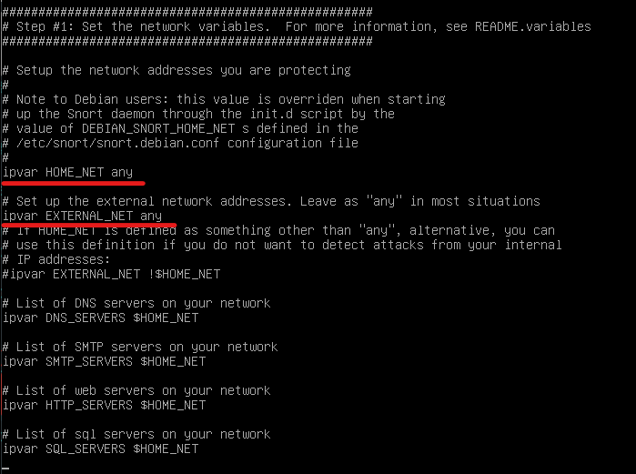
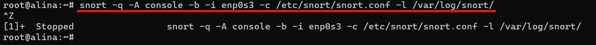

# 网络安全第九章实验报告  
## Snort  
### 实验环境  
* Debian 10.5.0  
* snort 2.9.7.0  
### 环境安装  
`apt install snort` 下载安装snort  
在交互式配置页面设置监听接口`enp0s3`  

#### 实验一：配置snort为嗅探模式  
```
# 显示IP/TCP/UDP/ICMP头
snort –v

# 显示应用层数据
snort -vd

# 显示数据链路层报文头
snort -vde

# -b 参数表示报文存储格式为 tcpdump 格式文件
# -q 静默操作，不显示版本欢迎信息和初始化信息
snort -q -v -b -i eth1 "port not 22"
```  
  
* `ping www.baidu.com` 查看ICMP头  
  

* `snort -q -vd` 显示应用层数据  
  

* `snort -q -vde` 显示数据链路层数据  
  

* `snort -q -v -b -i enp0s3 "port not 22"` 保存嗅探的数据  
    ```
    # 使用 CTRL-C 退出嗅探模式
    # 嗅探到的数据包会保存在 /var/log/snort/snort.log.<epoch timestamp>
    # 其中<epoch timestamp>为抓包开始时间的UNIX Epoch Time格式串
    # 可以通过命令 date -d @<epoch timestamp> 转换时间为人类可读格式
    # exampel: date -d @1511870195 转换时间为人类可读格式
    # 上述命令用tshark等价实现如下：
    tshark -i eth1 -f "port not 22" -w 1_tshark.pcap
    ```  
      

#### 实验二：配置并启用snort内置规则  
```
# /etc/snort/snort.conf 中的 HOME_NET 和 EXTERNAL_NET 需要正确定义
# 例如，学习实验目的，可以将上述两个变量值均设置为 any
snort -q -A console -b -i eth1 -c /etc/snort/snort.conf -l /var/log/snort/
```  

* `vi /etc/snort/snort.conf` 查看配置文件  
  
* `HOME_NET`和`EXTERNAL_NET`设置为`any`  
  
* `snort -q -A console -b -i enp0s3 -c /etc/snort/snort.conf -l /var/log/snort/` 启动规则  
  

#### 实验三：自定义snort规则  
```
# 新建自定义 snort 规则文件
cat << EOF > /etc/snort/rules/cnss.rules
alert tcp \$EXTERNAL_NET any -> \$HTTP_SERVERS 80 (msg:"Access Violation has been detected on /etc/passwd ";flags: A+; content:"/etc/passwd"; nocase;sid:1000001; rev:1;)
alert tcp \$EXTERNAL_NET any -> \$HTTP_SERVERS 80 (msg:"Possible too many connections toward my http server"; threshold:type threshold, track by_src, count 100, seconds 2; classtype:attempted-dos; sid:1000002; rev:1;)
EOF
```  

```
# 添加配置代码到 /etc/snort/snort.conf
include $RULE_PATH/cnss.rules
```  

```
snort -q -A fast -b -i eth1 -c /etc/snort/snort.conf -l /var/log/snort/
```  


