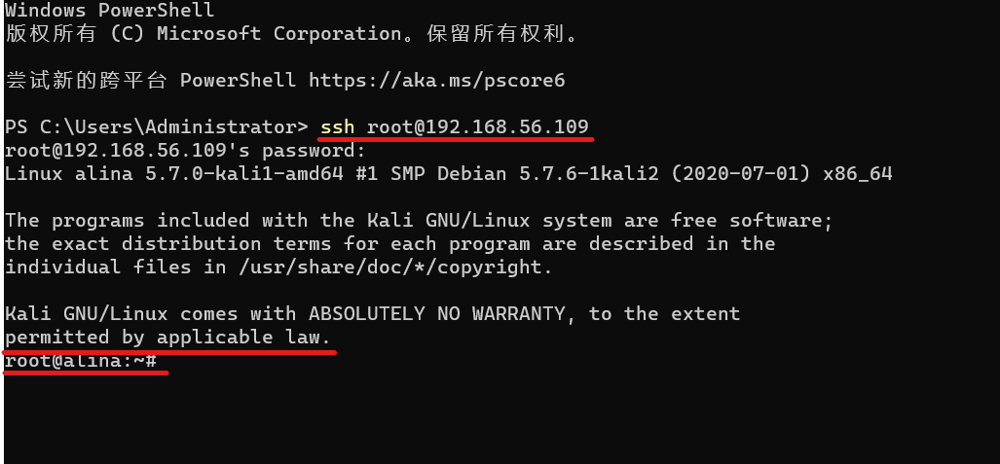

# 网络安全第十章实验报告  

## 应用程序安全加固  

### 使用fail2ban  

### 实验环境  
Kali 2020.3  
fail2ban  

#### 网络拓扑  
  

### 实验过程  
* 配置靶机ssh允许root登录  
`sudo vim /etc/ssh/sshd_config` 更改配置文件  
  
`sudo systemctl restart ssh` 重启ssh服务  
* 检验配置结果  
  
* 攻击者主机尝试爆破ssh  
`sudo gzip -d /usr/share/wordlists/rockyou.txt.gz` 解压爆破字典  
`hydra -l root -P /usr/share/wordlists/rockyou.txt -v 192.168.56.109 ssh`  
  
* 下载安装`fail2ban`  
`apt update && apt-get install fail2ban`  
`fail2ban-client start` 启动`fail2ban`  
  
* 根据文档将`fail2ban`配置加以改动  
  
* `fail2ban`配置生效，爆破失败  
  
* 停止使用`fail2ban`服务  
`fail2ban-client stop` 停止服务  
  

### 问题及解决  
1. 更改配置文件后依然不能root权限登录  
错误原因：Linux系统默认root密码，不是印象里自己设定的密码  
解决方案：`sudo passwd root` 手动设置root用户密码  
  

#### 参考资料  
[网络安全教材第十章](https://c4pr1c3.github.io/cuc-ns/chap0x10/main.html)  
[网络安全第十章课件](https://c4pr1c3.github.io/cuc-ns-ppt/chap0x10.md.html#/16/1)  
[Using Fail2ban to Secure Your Server - A Tutorial](https://www.linode.com/docs/guides/using-fail2ban-to-secure-your-server-a-tutorial/)  
[kali linux 开启SSH服务 容许root登陆](https://blog.csdn.net/u010953692/article/details/80312751)  
