# 网络安全第十一章实验报告  
## 常见蜜罐体验和探索  
### 实验目的  
* 了解蜜罐的分类和基本原理  
* 了解不同类型蜜罐的适用场合  
* 掌握常见蜜罐的搭建和使用  
### 实验环境  
* 从[paralax/awesome-honeypots](https://github.com/paralax/awesome-honeypots)中选择 1 种低交互蜜罐和 1 种中等交互蜜罐进行搭建实验  
    * 推荐`SSH`蜜罐  

#### 网络拓扑  
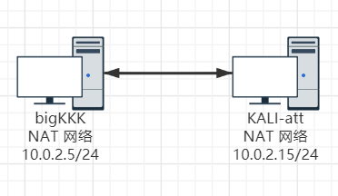  
ps：后因恢复快照，bigKKK虚拟机IP地址更改为：10.0.2.6  

#### 连通性检验  
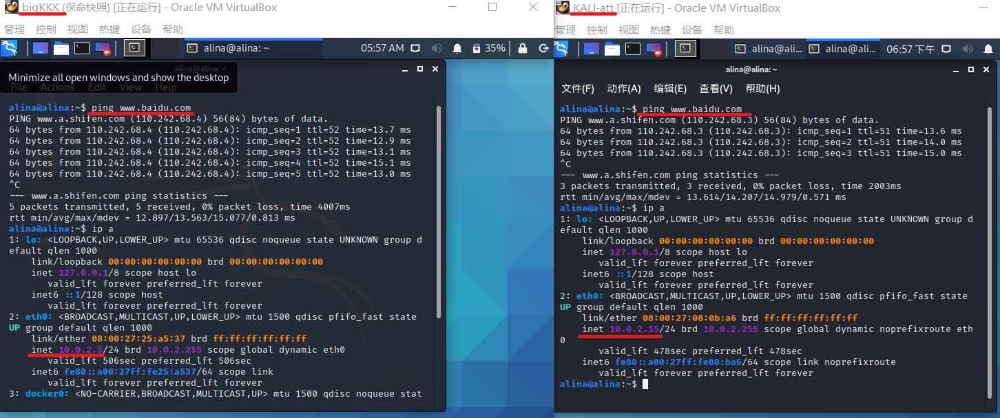  

### 实验要求  
 - [x] 记录蜜罐的详细搭建过程；  
 - [x] 使用`nmap`扫描搭建好的蜜罐并分析扫描结果，同时分析「 nmap 扫描期间」蜜罐上记录得到的信息；  
 - [x] 如何辨别当前目标是一个「蜜罐」？以自己搭建的蜜罐为例进行说明；  
 - [x] （可选）总结常见的蜜罐识别和检测方法；  
 - [ ] （可选）基于canarytokens搭建蜜信实验环境进行自由探索型实验；  

### 实验过程  
#### 低交互蜜罐 twisted-honeypots  
[twisted-honeypots](https://github.com/lanjelot/twisted-honeypots)  

**搭建原因：**  
1. 查看文档发现安装过程简单方便  
2. 基于python3的twisted实现  
3. 所有证据将会保存在本地的MySQL数据库中  

##### 蜜罐搭建
Kali环境安装python3  
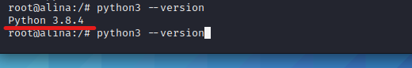  
```
pip3 install service_identity #安装依赖
git clone https://github.com/lanjelot/twisted-honeypots /opt/twisted-honeypots
cd /opt/twisted-honeypots
/etc/init.d/mysql start #开启MySQL服务
sudo ./install.sh && ./setup-db.sh
```  
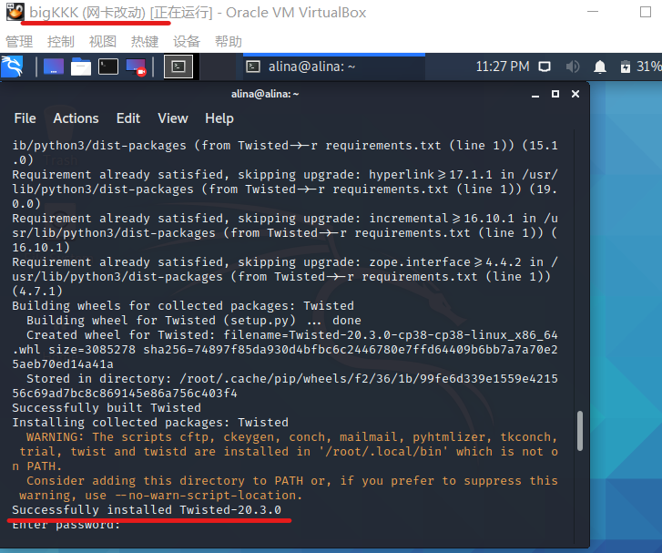  
蜜罐用法  
```
sudo ./start.sh #启动
sudo ./stop.sh #停止
./monitor.sh #查看攻击者行为 
```  
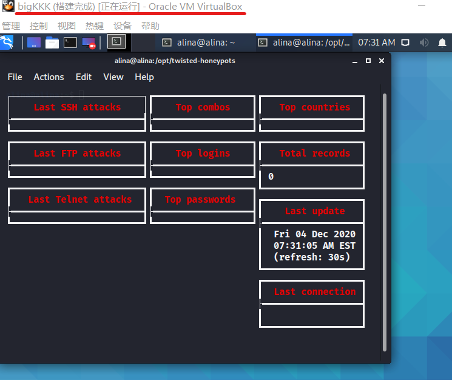  
首先尝试非root用户的登录：  
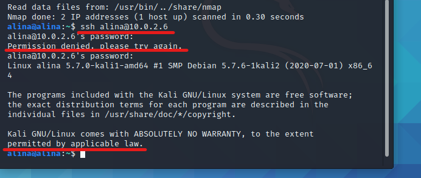  
错误密码会出现连接失败，只有正确密码才能保证连接  
尝试root用户的登录：  
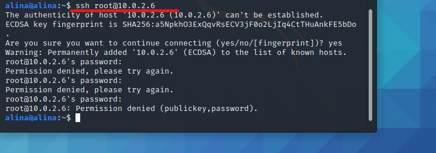  
反复尝试发现均无法进入  

##### nmap扫描  
```
#TCP connect scan
nmap -sT -P 22 -n -vv 10.0.2.6
#TCP Xmas scan
nmap -sX -P 22 -n -vv 10.0.2.6
#TCP NULL scans
nmap -sN -P 22 -n -vv 10.0.2.6
```  
TCP connect scan(获得记录)  
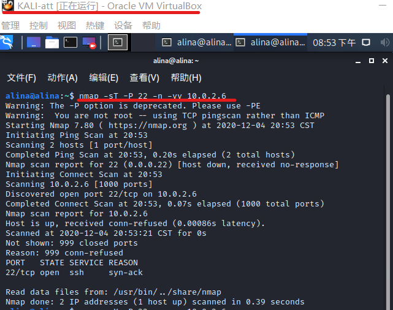  
TCP Xmas scan(未获得记录)  
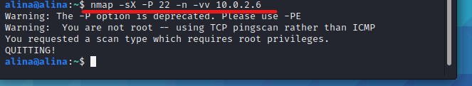  
TCP NULL scan(未获得记录)  
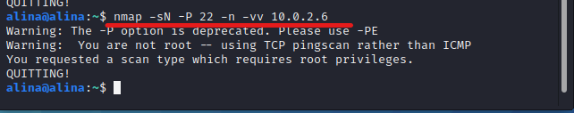  

##### 辨别蜜罐  
1. root权限反复登录失败(待解决)  
2. 普通用户可以行使root权限用户职责  
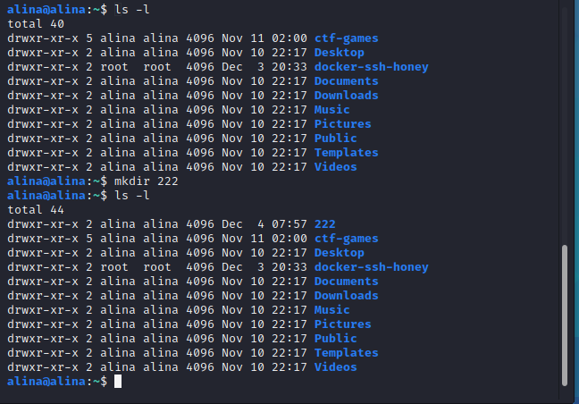  
3. 下载安装过程不真实  
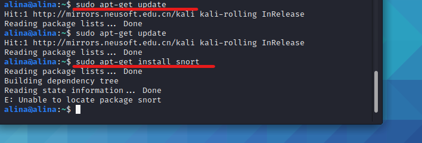  

#### 中高交互蜜罐 Cowrie  
[Cowrie](https://github.com/cowrie/cowrie)  

**搭建原因：**  
1. 四舍五入等于“docker一键安装”，方便快捷  
2. 旨在记录暴力攻击和攻击者执行的shell交互  
3. 用Python模拟UNIX系统  

##### 蜜罐搭建  
`docker pull cowrie/cowrie` 安装cowrie  
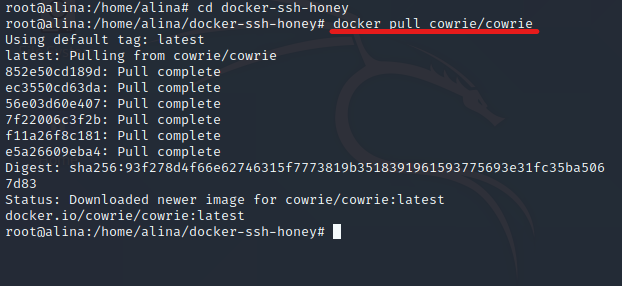  
`docker run -p 2222:2222 cowrie/cowrie` 启动cowrie  
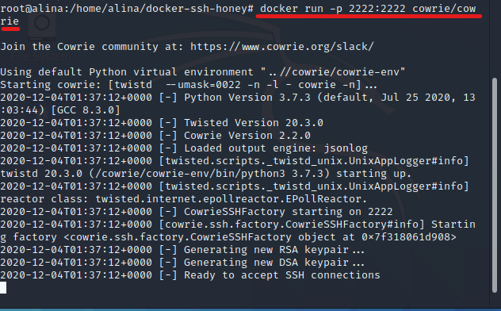  
首先尝试非root用户的正常登录：  
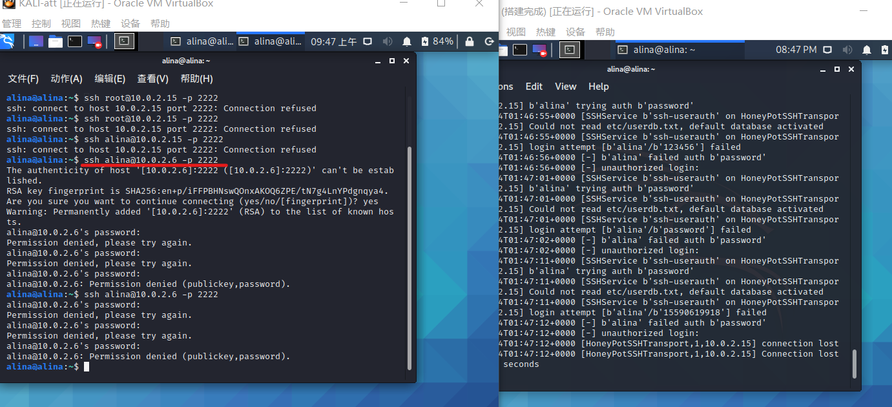  
多次尝试发现无论密码是否正确，全部尝试失败，盲猜该蜜罐不允许非root用户登录  
root用户的登录：  
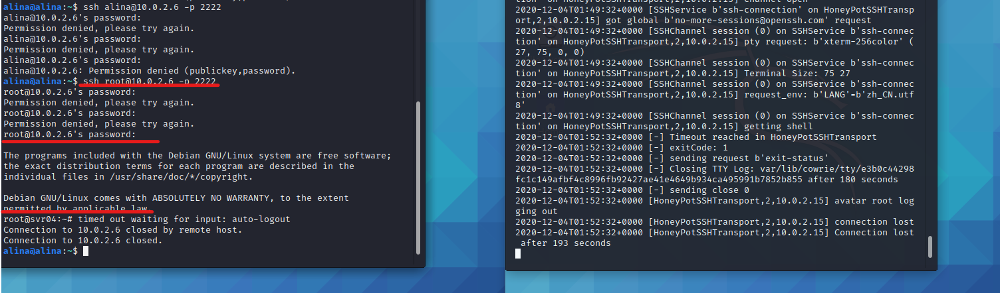  
随便输入密码即可正常登录，正确密码反而不能登录(这个蜜罐有点意思)  
`ping`及`curl`功能尝试：  
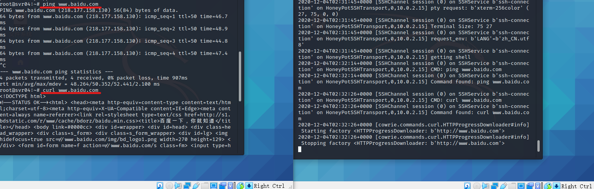  

##### nmap扫描  
```
#TCP connect scan
nmap -sT -P 2222 -n -vv 10.0.2.6
#TCP Xmas scan
nmap -sX -P 2222 -n -vv 10.0.2.6
#TCP NULL scans
nmap -sN -P 2222 -n -vv 10.0.2.6
```  
TCP connect scan(获得记录)  
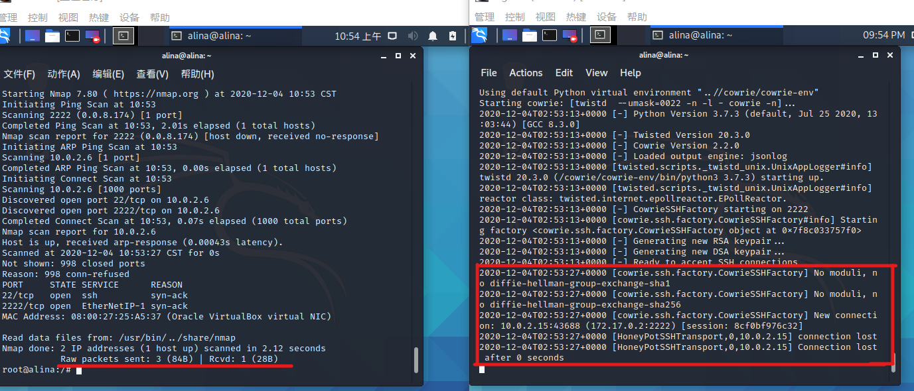  
TCP Xmas scan(未获得记录)  
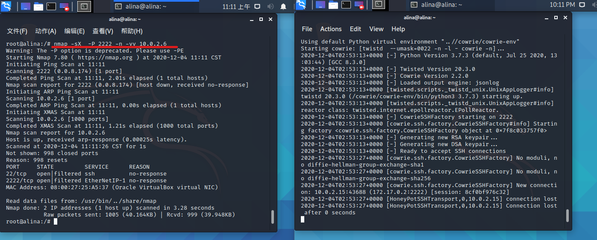  
TCP NULL scan(未获得记录)  
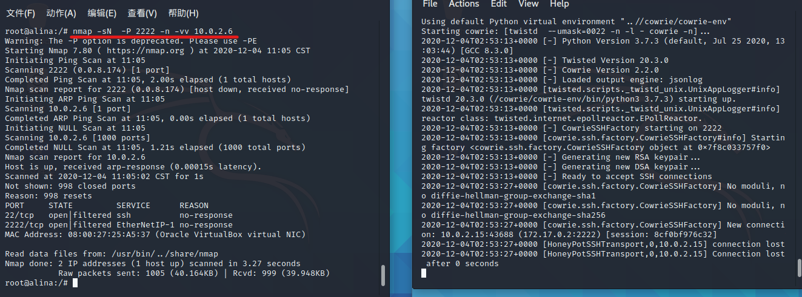  

##### 辨别蜜罐  
1. 超时连接自动断开  
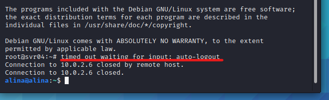  
印象中平常普通的ssh远程登录过程中并没有出现过超时断开的问题(而且，这个超时断开是不是太频繁了点，甚至命令执行一半也会出现超时...:joy:)  
2. 更新报错  
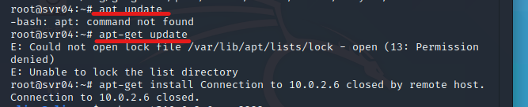  
正常Kali的环境支持`apt`和`apt-get`  
3. 下载安装过程重复  
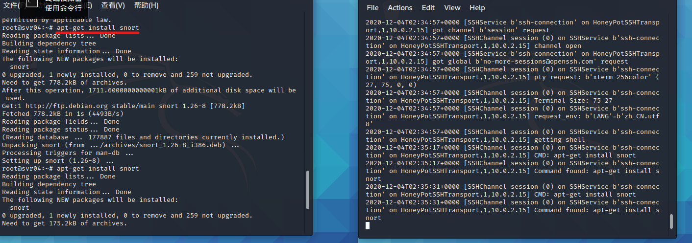  
多次下载安装，发现每一次的返回信息均相同，正常在第二次下载安装后就应该返回已安装，无更新  
4. 无法查看文件目录  
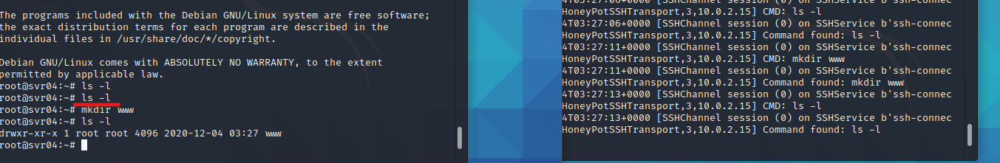  
正常是可以直接查看文件目录的，而在蜜罐环境中，仅可以查看自己创建的目录  

### 总结常见的蜜罐识别和检测方法  
**理论：**  
检测低交互蜜罐：  
1. 配置失真与资源抢夺  
2. 数据包时间戳分析  
3. 分析低交互蜜罐产生的网络响应来寻找差异  
4. 环境不真实导致穿帮  

检测高交互蜜罐：  
1. 检测和禁用sebek  
2. 检测蜜墙  

**根据本次实验总结：**  
1. 随便尝试密码即可进入环境要有所警惕，说不定就是布置好的陷阱  
2. 进入环境先尝试已知结果的命令，例如下载安装等，寻找漏洞  

引用知乎一句话：**蜜罐就是人家就是做好圈套让你进的，要判断全靠经验。**  

### 问题及解决  
1. ssh连接失败  
错误原因：Kali环境下ssh服务不是开机自启动  
解决方案：手动开启ssh服务，开放22端口  
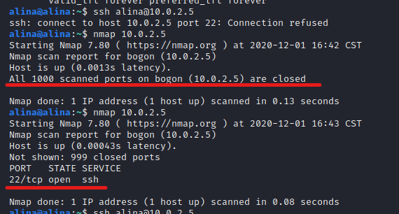  
2. ssh登录蜜罐显示密钥不匹配  
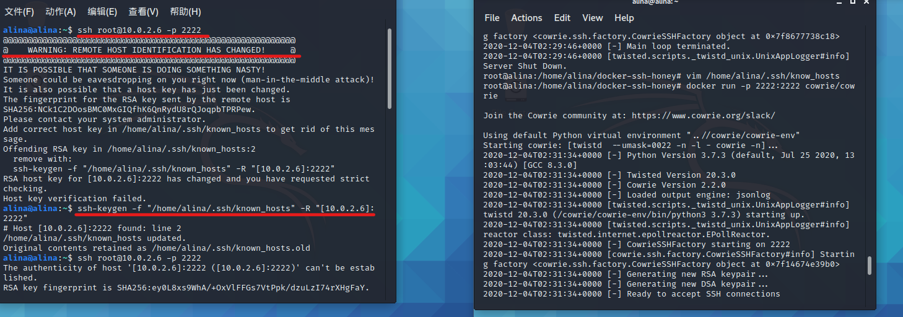  
错误原因：重启docker后密钥发生改变  
解决方案：`ssh-keygen -f "/home/alina/.ssh/known_hosts" -R "[10.0.2.6]:2222"` 删除保存密钥重新添加  

#### 参考资料  
[网络安全第十一章教材](https://c4pr1c3.github.io/cuc-ns/chap0x11/exp.html)  
[awesome-honeypots](https://github.com/paralax/awesome-honeypots)  
[Kali环境下安装Python3.7](https://www.cnblogs.com/forforever/p/12417156.html)  
[如何判断是不是进入了蜜罐？](https://www.zhihu.com/question/31213254)  
[2019-NS-Public-chencwx](https://github.com/CUCCS/2019-NS-Public-chencwx/tree/ns_chap0x11/ns_chapter11)  
